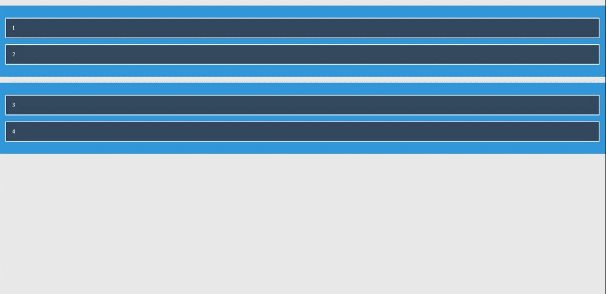

# Drag and Drop with vanilla JS

## I have make a two different drag & drop elements:

- ### one without sort feature

  

- ### other with sort feature

  

## resources:

- for sortable, I watch this video [How To Build Sortable Drag & Drop With Vanilla Javascript](https://youtu.be/jfYWwQrtzzY)
- for nonsortable one, I watch this [Drag & Drop using pure javascript | عمل تصميم يدعم السحب و الافلات بالجافاسكريبت](https://youtu.be/PfhAToxyd7s)
